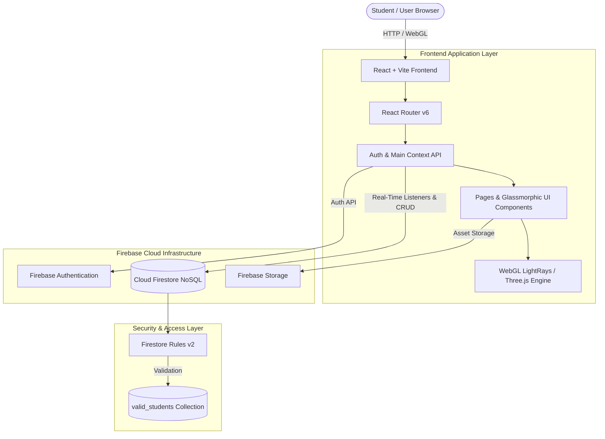
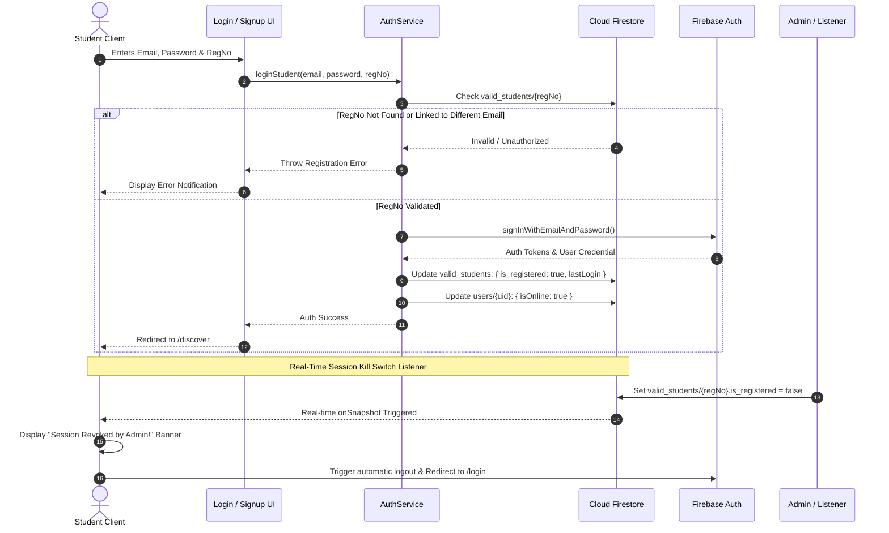

# 🚀 Campus Connect
### *The Next-Gen Real-Time Student Discovery & Networking Ecosystem*

[](https://opensource.org/licenses/MIT)
[](https://react.dev/)
[](https://vitejs.dev/)
[](https://tailwindcss.com/)
[](https://firebase.google.com/)
[](https://threejs.org/)

Campus Connect is **not just another student directory** — it is a high-performance, real-time, campus-exclusive social ecosystem engineered for university students to discover peers, collaborate on research, participate in campus events, and communicate securely.

Designed with modern glassmorphic aesthetics, WebGL shader lighting, real-time Firestore listeners, and a strict two-tier verification model.

---

## 📋 Table of Contents
- [✨ Key Features](#-key-features)
- [🏗️ System Architecture & Flowcharts](#-system-architecture--flowcharts)
  - [1. High-Level Architecture](#1-high-level-architecture)
  - [2. Gatekeeper Authentication & Kill-Switch Flow](#2-gatekeeper-authentication--kill-switch-flow)
  - [3. Real-Time Messaging & Ephemeral Chat Flow](#3-real-time-messaging--ephemeral-chat-flow)
- [🗄️ Database Schema & Data Models](#-database-schema--data-models)
- [🛠️ Tech Stack](#️-tech-stack)
- [🔐 Security & Access Control](#-security--access-control)
- [📦 Getting Started & Setup Guide](#-getting-started--setup-guide)
- [📁 Project Directory Structure](#-project-directory-structure)
- [🧪 Roadmap & Future Vision](#-roadmap--future-vision)
- [🤝 Contributing](#-contributing)
- [📜 License](#-license)

---

## ✨ Key Features

- 🛡️ **Campus Gatekeeper Verification**  
  Restricted access strictly bound to verified university registration numbers in `valid_students`. Prevents unauthorized external sign-ups.

- ⚡ **Real-Time Admin Session Kill Switch**  
  Integrated Firestore listener instantly revokes active student sessions and logs out users in real time if access status is modified by campus administration.

- 🃏 **Interactive Discovery Stack**  
  Swipeable card stack supporting dual discovery modes:
  - **Social Mode**: Swipe to discover peers filtered by department, batch, and interest tags.
  - **Volunteer Mode**: Explore and volunteer for campus activities, community events, and drives.

- 💬 **Real-Time Direct & Group Chat Engine**  
  Instant 1-on-1 private messaging and group chat rooms built on Cloud Firestore listeners with online presence indicator tracking (`isOnline` & `lastSeen`).

- ⏳ **Ephemeral Chat Rooms**  
  Temporary group chat rooms with an automated **1-hour expiration logic** designed for rapid project syncs and pop-up campus meetups.

- 🏆 **Club Hub & Leader Dashboard**  
  Role-based dashboard (`community_leader` vs `student`) allowing leaders to post activities, volunteer opportunities, and manage club announcements.

- 🌐 **Community Wall & Study Space**  
  Public campus feed where students share learning milestones, research projects, and find collaborators.

- 🌌 **Futuristic Glassmorphic WebGL UI**  
  Ultra-dark futuristic design featuring **OGL / Three.js** light ray shaders, responsive drawer navigation, custom cursors, and liquid transitions.

---

## 🏗️ System Architecture & Flowcharts

### 1. High-Level Architecture



---

### 2. Gatekeeper Authentication & Kill-Switch Flow



---

### 3. Real-Time Messaging & Ephemeral Chat Flow

```mermaid
flowchart LR
    subgraph Client A [Student A]
        A1[Select Peer / Group] --> A2[Send Message]
    end

    subgraph Firestore Backend
        B1[(chats Collection)]
        B2[(chats/{chatId}/messages Subcollection)]
    end

    subgraph Client B [Student B]
        C1[Live onSnapshot Listener] --> C2[Render Chat Bubble & Presence]
    end

    subgraph Expiry Worker
        E1[Check expiresAt Timestamp] -->|If Current Time > expiresAt| E2[Filter / Purge Ephemeral Room]
    end

    A2 -->|sendMessage service| B2
    A2 -->|updateDoc lastMessage| B1
    B2 -->|Real-Time Push| C1
    B1 --> Expiry Worker
```

---

## 🗄️ Database Schema & Data Models

Campus Connect operates under a **two-tier security model** in Cloud Firestore:

### 1. `valid_students` (Admin Access Control)
```json
{
  "registrationNumber": "241001001218",
  "email": "student@university.edu",
  "is_registered": true,
  "lastLogin": "Timestamp"
}
```

### 2. `users` (Student Profiles)
```json
{
  "uid": "firebase_auth_uid",
  "name": "Anirban Sarkar",
  "regNo": "241001001218",
  "branch": "CSE",
  "batch": "2024-28",
  "bio": "Coder / Innovator / Troubleshooter",
  "interests": ["Coding", "AI-ML", "Physics"],
  "role": "student",
  "photoUrl": "https://...",
  "isOnline": true,
  "lastSeen": "Timestamp",
  "updatedAt": "Timestamp"
}
```

### 3. `friend_requests` (Connection State)
```json
{
  "requestId": "uidA_uidB",
  "from": "uidA",
  "to": "uidB",
  "status": "pending",
  "createdAt": "Timestamp"
}
```

### 4. `chats` (Direct & Group Conversations)
```json
{
  "chatId": "uidA_uidB",
  "type": "group | ephemeral_group",
  "groupName": "Hackathon Squad",
  "users": ["uidA", "uidB", "uidC"],
  "createdBy": "uidA",
  "admins": ["uidA"],
  "lastMessage": "Let's meet at 5 PM!",
  "createdAt": "Timestamp",
  "updatedAt": "Timestamp",
  "expiresAt": "Timestamp (1 Hour from creation)"
}
```

#### Subcollection: `chats/{chatId}/messages`
```json
{
  "messageId": "auto_generated_id",
  "senderId": "uidA",
  "text": "Hey everyone!",
  "createdAt": "Timestamp"
}
```

### 5. `activities` (Club & Community Events)
```json
{
  "activityId": "auto_generated_id",
  "event_title": "Campus AI Hackathon",
  "community_name": "Coding Club",
  "description": "Building next-gen AI tools",
  "event_date": "2026-10-15",
  "image_url": "https://...",
  "volunteer_list": ["uidA", "uidB"]
}
```

---

## 🛠️ Tech Stack

### Frontend Core
- ⚛️ **React 18.3** — Functional components, custom hooks, and Context API architecture.
- ⚡ **Vite 7.2** — Instant Hot Module Replacement (HMR) and optimized ESbuild pipelines.
- 🚦 **React Router v6** — Declarative client-side routing & protected route wrappers.

### Styling & UI Design
- 🎨 **Tailwind CSS v4** — Utility-first engine with high-performance CSS `@theme` variables.
- 💫 **Framer Motion 12** — Smooth layout transitions and interactive card animations.
- 🎨 **Lucide React** — Crisp icon library.

### Shaders & WebGL Graphics
- 🧊 **Three.js** — 3D graphics rendering engine.
- ⚡ **OGL (Minimal WebGL)** — Custom GPU light ray background shader (`LightRays.jsx`).

### Backend (BaaS) & Database
- 🔥 **Firebase Authentication** — Secure email/password auth.
- 📦 **Cloud Firestore** — Real-time NoSQL document store with live snapshot sync.
- 💾 **Supabase JS Client** — Auxiliary database integration option.
- 🐍 **FastAPI / Python Admin SDK** — Python backend environment for batch verification & administrative scripts.

---

## 🔐 Security & Access Control

Firestore enforcement is governed by `firestore.rules` (rules version 2):

- **Campus Gatekeeper**: `valid_students` collection readable by clients for auth validation.
- **Profile Ownership**: `users/{userId}` documents are only writable by the authenticated owner (`request.auth.uid == userId`).
- **Private Messaging Shield**: Chat threads (`chats/{chatId}`) and nested messages (`messages/{messageId}`) are accessible **only** to users explicitly included in the `resource.data.users` array.

---

## 📦 Getting Started & Setup Guide

### Prerequisites
- **Node.js**: `v18.0.0` or higher
- **npm** or **yarn**

### 1️⃣ Clone the Repository
```bash
git clone https://github.com/your-username/campusConnect.git
cd campusConnect
```

### 2️⃣ Install Frontend Dependencies
```bash
cd frontend
npm install
```

### 3️⃣ Configure Environment / Firebase

Verify or update your Firebase configuration parameters in `frontend/src/conf/firebase.js`:

```javascript
import { initializeApp } from "firebase/app";
import { getAuth } from "firebase/auth";
import { getFirestore } from "firebase/firestore";
import { getStorage } from "firebase/storage";

const firebaseConfig = {
  apiKey: "YOUR_API_KEY",
  authDomain: "YOUR_PROJECT_ID.firebaseapp.com",
  projectId: "YOUR_PROJECT_ID",
  storageBucket: "YOUR_PROJECT_ID.appspot.com",
  messagingSenderId: "YOUR_SENDER_ID",
  appId: "YOUR_APP_ID"
};

const app = initializeApp(firebaseConfig);
export const auth = getAuth(app);
export const db = getFirestore(app);
export const storage = getStorage(app);
```

### 4️⃣ Run Development Server
```bash
npm run dev
```
Open your browser at `http://localhost:5173`.

### 5️⃣ (Optional) Python FastAPI Backend Setup
```bash
# In the repository root
pip install -r requirements.txt
```

---

## 📁 Project Directory Structure

```
campusConnect/
├── firestore.rules          # Security rules for Cloud Firestore
├── db.json                  # Local seed / mock database reference
├── requirements.txt         # Python dependencies for admin tools
├── LICENSE                  # MIT License
└── frontend/
    ├── package.json         # Node.js dependencies and scripts
    ├── vite.config.js       # Vite build configuration
    ├── index.html           # Main HTML document entrypoint
    └── src/
        ├── main.jsx         # App entrypoint
        ├── App.jsx          # Routes definition & Protected Route wrapper
        ├── index.css        # Global CSS, theme variables & WebGL canvas reset
        ├── conf/
        │   ├── firebase.js  # Firebase SDK initialization
        │   └── supabase.js  # Supabase client setup
        ├── context/
        │   └── mainContext.jsx # Auth state, profile listener & Kill-Switch logic
        ├── services/
        │   ├── Authservice.js    # Login, signup, logout & online status services
        │   ├── chatService.js    # Direct, group, ephemeral chat & real-time listeners
        │   └── profileService.js # Profile fetch & update methods
        ├── components/
        │   ├── Layout.jsx           # Responsive Navbar & Sidebar shell
        │   ├── Loading.jsx          # Futuristic loading screen
        │   ├── NotificationsPopup.jsx # Real-time alert notifications
        │   ├── BrandLogo.jsx        # Animated brand logo component
        │   ├── Cards/
        │   │   ├── CardStack.jsx    # Swipeable card container logic
        │   │   ├── ProfileCard.jsx  # Student profile card rendering
        │   │   └── VolunteerCard.jsx# Activity/Volunteer card rendering
        │   ├── auth/
        │   │   ├── LoginUI.jsx      # Login interface
        │   │   └── SignUpUI.jsx     # Registration interface
        │   └── effects/
        │       ├── LightRays.jsx    # WebGL GPU Light Rays shader canvas
        │       └── LightRays.css    # Shader layout styling
        └── pages/
            ├── LandingPage.jsx      # Hero landing page
            ├── Login.jsx            # Auth entry page
            ├── Discovery.jsx        # Swipe card discovery (Social / Volunteer)
            ├── Community.jsx        # Campus feed & post sharing
            ├── Chat.jsx             # Real-time chat application interface
            ├── Find.jsx             # Advanced student search & directory filter
            ├── Requests.jsx         # Connection / Friend request management
            ├── Profile.jsx          # Student profile view
            ├── EditProfile.jsx      # Profile editor
            ├── ClubHub.jsx          # Campus clubs catalog
            ├── ClubLeadDashboard.jsx# Club leader management dashboard
            └── Feedback.jsx         # Campus user feedback submission
```

---

## 🧪 Roadmap & Future Vision

- [x] **Campus Gatekeeper Verification**
- [x] **Real-Time Admin Kill-Switch**
- [x] **Student Profile Management**
- [x] **Friend Request Handshake Engine**
- [x] **Direct & Group Real-Time Chat**
- [x] **Ephemeral Chat Room Logic**
- [x] **WebGL Light Rays Background Shaders**
- [ ] 🤖 **AI Matchmaker**: ML-driven student pairing based on project goals & interests.
- [ ] 📱 **Mobile Native**: React Native mobile app build for iOS & Android.
- [ ] 🔒 **End-to-End Encrypted Chat**: Client-side payload encryption for private messages.

---

## 🤝 Contributing

Contributions make the campus community thrive! To contribute:

1. **Fork** the Repository.
2. Create a Feature Branch: `git checkout -b feature/CoolCampusFeature`
3. Commit your Changes: `git commit -m 'Add CoolCampusFeature'`
4. Push to the Branch: `git push origin feature/CoolCampusFeature`
5. Open a **Pull Request**.

---

## 📜 License

Distributed under the **MIT License**. See [`LICENSE`](LICENSE) for details.

---

<p align="center">
  Built with ❤️ for students, by students. If you find Campus Connect helpful, give it a ⭐ on GitHub!
</p>


